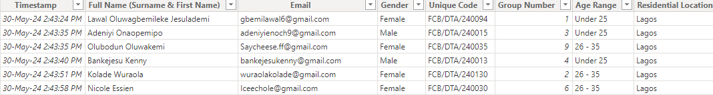
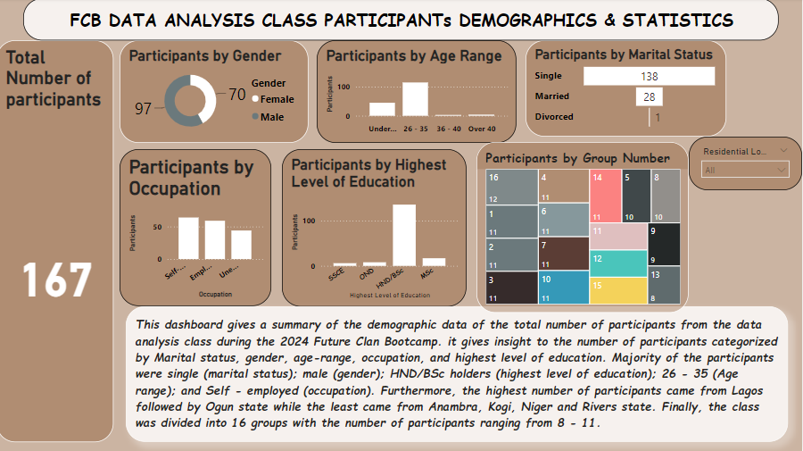
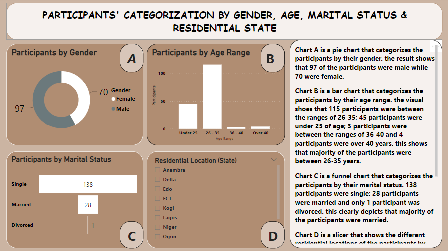
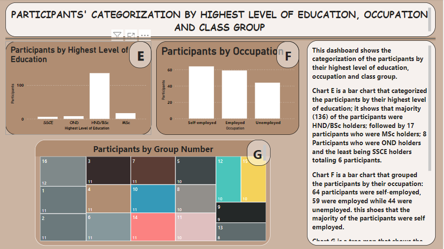
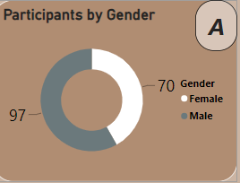
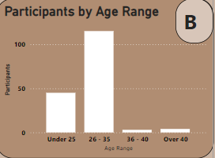
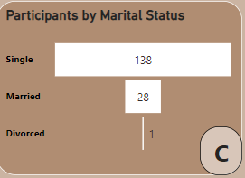
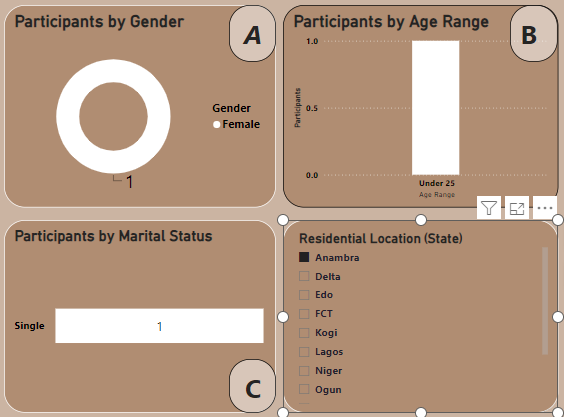

# Future-Clan-Participant-Project
## Overview
This is my first official data analysis project. The data set used was obtained onsite from the participants of the data analysis class during the Future Clan Bootcamp. This project aims at uncovering insights from the participants' data set through the analysis of their demographics and other parameters in the data set to enable better understanding of the participants' categories, similarities as well as their differences.

## Project Outline
- Data Source
- Tools Used
- Visualizations
- Reports
- Insights

### Data Source
 The data set used is a google sheet data set and was primarily sourced from an online service [Google Sheet} (https://docs.google.com/spreadsheets/d/1slHSvA-UtOkseFsfuJJZiOL222vusWt6xEbFOXYxElQ/edit#gid=1248562073)

Here's a view of the outlook of the data set;

The data set before cleaning and transformation had a total number of 12 columns consisting of:
- Time stamp
- Email Address
- Full name (surname and first name)
- Email
- Gender
- Unique code
- Group Number
- Age range
- Residential Location (state)
- Highest Level of Education
- Marital status
- Occupation
 

### Tools Used
- Microsoft Power BI was used for data analysis using the power query editor and data visualization tools.

### Visualizations
The dashboard visual and the report visuals will be used to explain the data set and the categorizations of the popukatiob present in the data analysis class of the Future clan Bootcamp

#### *The dashboard Visuals*

this dashboard above gives a summary of all the visuals used in analysing this data set to better understand the class participants, identify trends and derive meaningful insight. 
tHE dashboard answers the following questions:
- How many participants attended the data analysis class?
- What is the categorization of the participants by age?
- What is the categorization of the participants by gender?
- What is the categorization of the participants by marital status?
- What is the categorization of the participants by occupation?
- What is the categorization of the participants by highest llevel of education?
- What is the categorization of the participants based on residential location?
- How many class groups were created and how many participants were present in each group?

#### *Report Visuals*

Report 1

Report 2

### Findings
Findings from report one answers the questions of the age, gender, and marital status

#### Findings from the categorization of participants by Gender
 
---
Chart A above is a pie chart that shows the categorization of the participants by their gender. The 2 specific genders accross the entire participants are male and female gender. the report shows that 97 participants were male while 70 participants were female.  

#### Findings from the categorization of participants by Age group

---
The age range of the participants were grouped into: Under 25, 26 - 35, 36 - 40, and over 40.
Chart B above is a bar chart that shows the categorization of the participants by their age group. The findings showed that 45 participants were under 25; 115 participants were between 26 - 35 years of age; 3 participants were between 36 - 40 years of age; and 4 participants were over 40 years of age as shown in Chart B above. it is therefore true to say that majority of the participants were between 26 - 35 years of age from the analysis.

#### Findings from the categorization of participants by Marital Status

---
Chart C above is a funnel chart that categorized the participants by their marital status. Findings from the analysis shows that 138 participants were single; 28 participants were married and only 1 participant was divorced. Therefore, Majority of the participants were single. 

#### Findings from the categorization of participants by Residential Location
The participants were spread across 12 states of the federation: Anambra, Delta, Edo, FCT, Kogi, Lagos, Niger, Ogun, Ondo, Osun, Oyo, and Rivers state.
the Visual used to identify total number of participants was a *Slicer* that has the different locations and by clicking any state on the slicer, it automtically gives a summary and categorization of the participants by their residential location.

