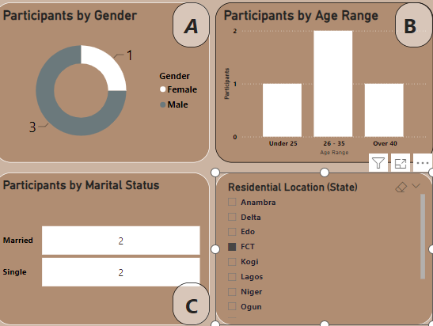
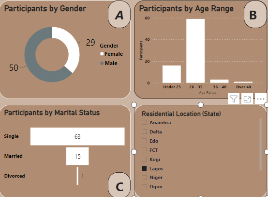
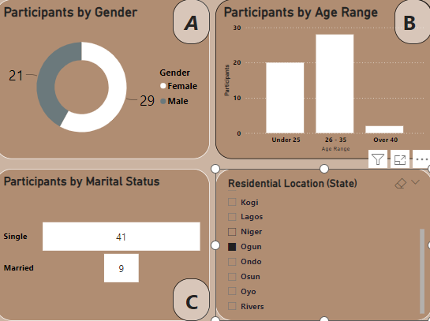

# Future-Clan-Participant-Project
## Overview
This is my first official data analysis project. The data set used was obtained onsite from the participants of the data analysis class during the Future Clan Bootcamp. This project aims at uncovering insights from the participants' data set through the analysis of their demographics and other parameters in the data set to enable better understanding of the participants' categories, similarities as well as their differences.

## Project Outline
- Data Source
- Tools Used
- Visualizations
- Reports
- Insights

### Data Source
 The data set used is a google sheet data set and was primarily sourced from an online service [Google Sheet} (https://docs.google.com/spreadsheets/d/1slHSvA-UtOkseFsfuJJZiOL222vusWt6xEbFOXYxElQ/edit#gid=1248562073)

Here's a view of the outlook of the data set;

The data set before cleaning and transformation had a total number of 12 columns consisting of:
- Time stamp
- Email Address
- Full name (surname and first name)
- Email
- Gender
- Unique code
- Group Number
- Age range
- Residential Location (state)
- Highest Level of Education
- Marital status
- Occupation
 

### Tools Used
- Microsoft Power BI was used for data analysis using the power query editor and data visualization tools.

### Visualizations
The dashboard visual and the report visuals will be used to explain the data set and the categorizations of the popukatiob present in the data analysis class of the Future clan Bootcamp

#### *The dashboard Visuals*

this dashboard above gives a summary of all the visuals used in analysing this data set to better understand the class participants, identify trends and derive meaningful insight. 
tHE dashboard answers the following questions:
- How many participants attended the data analysis class?
- What is the categorization of the participants by age?
- What is the categorization of the participants by gender?
- What is the categorization of the participants by marital status?
- What is the categorization of the participants by occupation?
- What is the categorization of the participants by highest level of education?
- What is the categorization of the participants based on residential location?
- How many class groups were created and how many participants were present in each group?

#### *Report Visuals*

Report 1

Report 2

### Findings
Findings from report one answers the questions of the age, gender, and marital status

#### Findings from the categorization of participants by Gender
 
---
Chart A above is a pie chart that shows the categorization of the participants by their gender. The 2 specific genders accross the entire participants are male and female gender. the report shows that 97 participants were male while 70 participants were female.  

#### Findings from the categorization of participants by Age group

---
The age range of the participants were grouped into: Under 25, 26 - 35, 36 - 40, and over 40.
Chart B above is a bar chart that shows the categorization of the participants by their age group. The findings showed that 45 participants were under 25; 115 participants were between 26 - 35 years of age; 3 participants were between 36 - 40 years of age; and 4 participants were over 40 years of age as shown in Chart B above. it is therefore true to say that majority of the participants were between 26 - 35 years of age from the analysis.

#### Findings from the categorization of participants by Marital Status

---
Chart C above is a funnel chart that categorized the participants by their marital status. Findings from the analysis shows that 138 participants were single; 28 participants were married and only 1 participant was divorced. Therefore, Majority of the participants were single. 

#### Findings from the categorization of participants by Residential Location
The participants were spread across 12 states of the federation: Anambra, Delta, Edo, FCT, Kogi, Lagos, Niger, Ogun, Ondo, Osun, Oyo, and Rivers state.
the Visual used to identify total number of participants was a *Slicer* that has the different locations and by clicking any state on the slicer, it automtically gives a summary and categorization of the participants by their residential location.

**Participants by Anambra State**

---
The above visual report shows the total number of participants that came from Anambra State. Only 1 participant came from Anambra as well as from other states such as Kogi State, Niger and Rivers state. this could be as a result of the long distance between the venue and the state of residence. All of the prticipants from these states were single and betwen 26 - 35 years of age.

**Participants by FCT**

---
The above visual report shows the total number of participants that came from Federal Capital Territory (FCT). 4 participants came from FCT as well as from Delta State. This could be as a result of the long distance between the venue and the state of residence coupled with the rise in the cost of transportation. 2 of the participants from FCT were single while 2 participants were married; 1 participant was under 25 years, 2 were between 26 - 35 years of age and 1 was over 40 years of age. 
Furthermore, states such as Ondo, Osun and Oyo have a total number of 5, 6, and 13 participants respectively.

**Participants by Lagos State**

---
The above visual report shows the total number of participants that came from Lagos State. 79 participants came from Lagos State. This could be as a result of the close proximity between the venue and the state of residence. 63 participants were single; 15 participants were married and 1 participant was divorced. Also, 16 participants were under 25 years, 59 were between 26 - 35 years of age, 3 were between 36 - 40 years of age and 1 was over 40 years of age. 
Lagos state as seen, has the highest number of participants even compared to the host state.

**Participants by Host State**

---
Ogun state was the host state of the boot camp as the boot camp was held right in the state. The above visual report shows the total number of participants that came from Ogun State. 50 participants came from Ogun State. Ordinarily, it would ne expected that Ogun State should produce the majority of the participants being that it was held right in the state but that wasnt the reality. There are a couple of factors that could have influenced this outcome which includes but are not restricted to lack of awareness, majority not being tech-inclined in the area and a host of other factors. 41 participants were single and 9 participants were married. Also, 20 participants were under 25 years, 28 were between 26 - 35 years of age, and 1 was over 40 years of age. 

