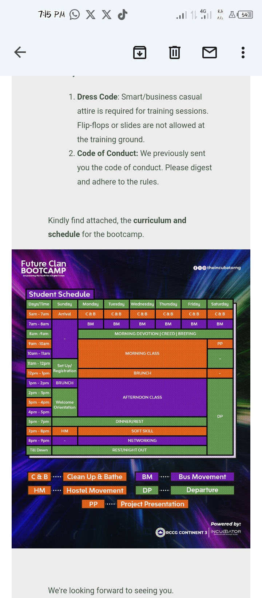

# Future-Clan-Documentation-Project
## Overview
This is the first official project on the Future Clan Data Analysis Bootcamp. This project aims at uncovering insights from a data set by analysing the set out parameters in the data set to enable stake holders make informed and reasonable decision.

## Project Outline
- Data Source
- Tools Used
- Reports

### Data Source
The data set used is a public data set in a csv format and was primarily obtained from an online data base i.e Kaggle and can be downloaded [Here] (https://Kaggle.com) 

### Tools Used
- MS EXCEL for data cleaning [click here to download](https://microsoft.com)
- MICROSOFT BI for analysis and visualization.
- Python
- SQL

  **bi**
  
  _italics_

  ~strike through~
---
```
Google Query Sheet

SELECT * FROM TABLE 1
WHERE CONDITION = MET

```

