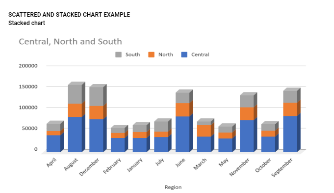

# Future-Clan-Participant-Project
## Overview
This is the first official project on the Future Clan Data Analysis Bootcamp. This project aims at uncovering insights from the participants' data set by analysing the demographics and other parameters in the data set to enable entire class better understand.

## Project Outline
- Data Source
- Tools Used
- Visualizations
- Reports
- Insights

### Data Source
 The data set used is a google sheet data set and was primarily sourced from an online service [Google Sheet} (https://docs.google.com/spreadsheets/d/1slHSvA-UtOkseFsfuJJZiOL222vusWt6xEbFOXYxElQ/edit#gid=1248562073)

### Tools Used
- MICROSOFT BI was used for data analysis using the power query and data visualization.


```


|Heading 1 | Heading 2| Heading 3|
|--------- | -------- | ------- |
| Data 1   | Data 2   | Data 3  |
